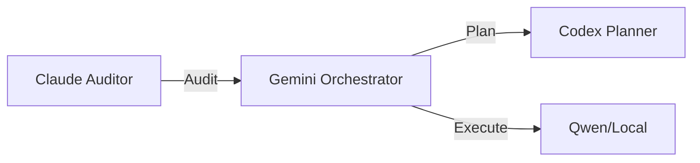

# cc-status

Use this skill when the user runs the command `status`. This skill adapts its output based on the environment (Claude Code or CLI).

## Command Template

Generate a comprehensive status report covering the entire Central Command ecosystem.

**Data Sources:**
- File system directories
- `%CC%\Projects\data\projects-registry.json`
- `%CC%\Projects\data\automation-registry.json`
- `%CC%\Projects\data\agent-state\coordination-state.json`
- `%CC%\artifacts\automation_health_report.json`
- `%CC%\sessions\SESSION_*.md`

---

## OUTPUT LOGIC BY ENVIRONMENT

### A) CLAUDE CODE (Rich UI)
If the session is running in Claude Code, use **Markdown Artifacts** and **Rich Formatting**:

1. **Header**: Use a `#` title and a `> [!NOTE]` alert for the timestamp.
2. **Projects Table**: Use a Markdown table for high-priority projects.
3. **File System**: Use a `carousel` if there are many directories to show.
4. **Session Launcher**: Provide clickable links to session templates in `%CC%\sessions\`.
5. **Quick Actions**: Use bullet points with [ACTION] prefix. NO EMOJIS.

### B) CLI (Terminal)
If the session is running in a standard terminal, use **ASCII formatting**:

1. **Header**: Use the `═════════` box.
2. **Projects**: Use the `┌───┐` table format.
3. **Session Launcher**: List IDs for manual command input (e.g., `/load proj-001`).

---

## SECTION 1: SYSTEM OVERVIEW (Claude Code optimized)

```markdown
# Central Command Status
> [!NOTE]
> **Generated**: [timestamp] | **Environment**: Claude Code
```

---

## SECTION 2: DEVELOPMENT PROJECTS (Active & High Priority)

**Read from:** `projects-registry.json`

### Active Projects

Present projects with this descriptive format:

* **`[proj-id]` | [Project Name]**
    * **Description**: [1-line technical description]
    * **Status**: `[Status]`. [Brief note on current activity or ETA].

---

## SECTION 3: SESSION LAUNCHER (Contextual)

**Scan Path:** `%CC%\sessions\SESSION_*.md`

> [!TIP]
> Select a project to load its master context and activate the v3 orchestration flow.

- **[proj-000]**: [Central Command Core](file:///%CC%/sessions/SESSION_proj-000.md)
- **[proj-001]**: [Reportes Ventas Nacional](file:///%CC%/sessions/SESSION_proj-001.md)
- **[proj-014]**: [AEV Email Generator](file:///%CC%/sessions/SESSION_proj-014.md)
- **[proj-011]**: [PyStack-AI (Core Engine)](file:///%CC%/sessions/SESSION_proj-011.md)

---

## SECTION 4: FILE SYSTEM STATUS

````carousel
```markdown
### Downloads (High Priority)
- **Total**: X files (Y MB)
- **New (24h)**: Z files [NEW]
- **Security**: W executables [WARN: Audit recommended]
```
<!-- slide -->
```markdown
### Desktop & Projects
- **Desktop**: X files (Needs cleanup: [yes/no])
- **Projects Dir**: X dirs (Y with changes)
```
````

---

## SECTION 5: AGENT COORDINATION

**Read from:** `coordination-state.json`



---

## SECTION 6: AUTOMATION SENTINEL

**Read from:** `automation_health_report.json`

| Automation | Project | Status | Last Run |
| :--- | :--- | :--- | :--- |
| [name] | [proj_id] | [OK / FAIL] | [time] |

> [!NOTE]
> Summary: [healthy] Healthy | [failed] Failed | [warnings] Warnings.

---

## SECTION 7: QUICK ACTIONS

- [ACTION] Run Sentinel: Run `python tools/automation_sentinel.py` to refresh health metrics.
- [ACTION] Fix Drifts: Reconcile `auto-007` (MonthlyCorporateRequests) to Local-First.
- [ACTION] Sync Registry: Synchronize detected changes in `projects-registry.json`.
- [ACTION] Active Context: Continue with the selected project above.

---

## PowerShell Commands (Data Gathering)

```powershell
# Get Sessions
Get-ChildItem -Path "C:\Users\msi\central_command\sessions" -Filter "SESSION_*.md" | Select-Object Name

# Get Projects with Status
$reg = Get-Content "C:\Users\msi\central_command\Projects\data\projects-registry.json" | ConvertFrom-Json
$reg.projects | Where-Object { $_.status -eq 'active' } | Select-Object id, name, type, last_activity
```

---

## Output Guidelines

1. **Dynamic Branding**: Use "Claude Code" or "CC Agent" branding.
2. **Resilience**: If Claude/Codex are offline or **SURVIVAL MODE (T-400)** is active, add a `> [!WARNING]` stating "Gemini Survival Mode Active (Primary Orchestrator: Antigravity)".
3. **Links**: Ensure all file paths are absolute and clickable.
4. **Emoji Usage**: NO EMOJIS in technical sections. Use bracketed labels [OK], [WARN], [ACTION].
