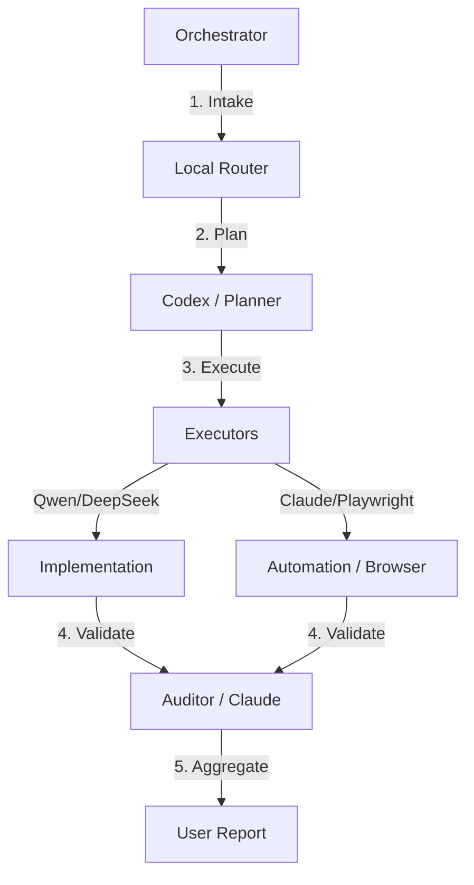

# Central Command

Multi-agent orchestration system for file management, code implementation, and development project tracking. Built around a local-first routing architecture that minimizes cloud API costs.

## 🏛 Architecture



### Module Structure

```
central_command/
├── local_router/     # Deterministic-first task classifier + circuit breaker
│   ├── registry.py   # Agent registry (YAML), health checks, fallback chains
│   ├── classifier.py # 4-phase routing: tool→keywords→LLM→fallback
│   └── executor.py   # Circuit breaker, retry escalation, per-agent metrics
├── browser/          # Playwright MCP automation (3-tier cost system)
│   ├── controller.py # Tier 1→2→3 escalation orchestrator
│   ├── dom_processor.py  # Regex/pattern DOM parsing (Tier 1, $0)
│   ├── action_planner.py # Ollama planning (Tier 2, $0)
│   └── appsheet/     # AppSheet-specific selectors and navigation
├── providers/        # Unified BaseProvider interface
│   ├── ollama_provider.py    # Local models via Ollama API
│   ├── claude_provider.py    # Claude CLI subprocess
│   ├── gemini_cli_provider.py # Gemini CLI subprocess
│   ├── perplexity_provider.py # Perplexity API
│   └── browser_provider.py   # Playwright MCP bridge
├── skills/           # Domain-specific capabilities
├── autonomy/         # Self-supervision, critic, and rule engine
├── context/          # Indexer and context manager
└── config.py         # Centralized configuration (models, timeouts, tiers)
```

## 🚀 Key Features

- **Local-first routing**: Deterministic keyword matching before any LLM call. Local models ($0) preferred on tie-breaks.
- **Circuit breaker**: 3-retry escalation (retry → retry+context → fallback chain). Fast-fail for destructive operations (2 failures → halt).
- **10 registered agents**: 3 local (qwen2.5-coder, deepseek-coder-v2, gemma3), 6 cloud (Claude, Gemini, Perplexity), 1 tool (Playwright).
- **Browser automation**: 3-tier cost system — regex $0 → Ollama $0 → Claude $$$ — for AppSheet and web automation.
- **Health monitoring**: Periodic Ollama `/api/tags` probes, env var checks for cloud keys, automatic failover.

## 🛠 Setup

```bash
# Install dependencies
pip install -e ".[dev]"

# Run tests
pytest

# Lint & format
ruff check scripts/central_command/
ruff format scripts/central_command/
```

## 📋 Requirements

- Python 3.10+
- Ollama (optional, for local models)
- Claude Code CLI (for Claude provider)
- Playwright MCP (for browser automation)

## ⚙️ Configuration

All configuration lives in `scripts/central_command/config.py`. Agent definitions are declared in `scripts/central_command/local_router/agents.yaml`.

## 📄 License

Private — Internal use only.
