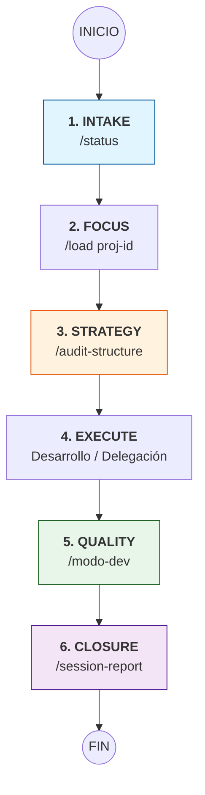

# 🗺️ Guía Maestra de Orquestación — Gemini Antigravity (v4.5)
**Propósito**: Definir el flujo óptimo de interacción entre el usuario y el orquestador Gemini para mantener el estándar A+.

---

## 📊 Visual Workflow (Master SOP)

---

## 🚀 Fase 1: Sincronización e Intake (El Despegue)
Antes de tocar cualquier código, Gemini debe entender dónde está parado.

1.  **Comando**: `/status`
    - **Skill**: `source-command-status`
    - **Resultado**: Visión 360° de proyectos activos, salud de automatizaciones y archivos nuevos.
2.  **Comando**: `/sessions`
    - **Skill**: `session-bridge`
    - **Resultado**: Si vienes de trabajar en móvil (SSH) o Claude Code, esto te permite ver qué sesiones hay para restaurar.

---

## 📂 Fase 2: Carga de Contexto (El Enfoque)
Gemini necesita "ponerse la gorra" del proyecto específico.

1.  **Comando**: `/load [proj-id]`
    - **Skill**: `source-command-context`
    - **Resultado**: Carga el archivo `SESSION_proj-*.md`, establece el directorio de trabajo y activa las reglas del proyecto.
2.  **Comando**: `/load-session gemini latest`
    - **Skill**: `session-bridge`
    - **Resultado**: Restaura el hilo lógico de la última sesión CLI al chat actual de Antigravity.

---

## 🏛️ Fase 3: Auditoría y Planificación (La Estrategia)
No se construye sobre cimientos débiles.

1.  **Comando**: `/audit-structure`
    - **Skill**: `project-architect`
    - **Resultado**: Detecta "root garbage", archivos legacy y bloat. Propone un refactor "Clean Root".
2.  **Comando**: `Genera un ACTION_PLAN_[ID].md`
    - **Resultado**: Gemini descompone el requerimiento en fases y asigna tareas (Gemini para orquestación, Claude para edición pesada, Qwen para ETL local).

---

## 🛠️ Fase 4: Ejecución y Hardening (El Desarrollo)
Implementación iterativa con enfoque en "AI-Readiness".

- **Regla de Oro**: Archivos < 200 líneas, type hints y comentarios claros.
- **Acción**: Delegar a Claude Code vía `claude -p "instrucción"` para ediciones multi-archivo.

---

## 🛡️ Fase 5: Validación Técnica (El Filtro)
Asegurar que lo construido no sea "código muerto".

1.  **Comando**: `/modo-dev`
    - **Skill**: `modo-dev`
    - **Resultado**: Auditoría técnica de 4 fases (Contexto, Calidad, Documentación, Integridad).
2.  **Comando**: `/freshness-check`
    - **Skill**: `skill_freshness_check.py` (vía script)
    - **Resultado**: Valida que las habilidades del proyecto sigan vigentes tras los cambios.

---

## 📝 Fase 6: Cierre y Handoff (El Aterrizaje)
Documentar para que el "Gemini del futuro" entienda qué pasó.

1.  **Comando**: `/session-report`
    - **Skill**: `source-command-session-report`
    - **Resultado**: Realiza el **Doc-Sweep** obligatorio y genera el reporte MD con cambios, decisiones y pendientes.
2.  **Acción**: Actualizar `projects-registry.json` si hubo cambios en la estructura o skills.

---

## 💡 Resumen de Skills por Rol de Gemini

| Rol | Skill Principal | Cuándo usar |
| :--- | :--- | :--- |
| **Detective** | `source-command-status` | Al iniciar el día. |
| **Arqueólogo** | `session-bridge` | Al regresar de trabajar remoto. |
| **Arquitecto** | `project-architect` | Antes de un refactor. |
| **Auditor** | `modo-dev` | Antes de cada commit/cierre. |
| **Notario** | `session-report` | Al finalizar la tarea. |
