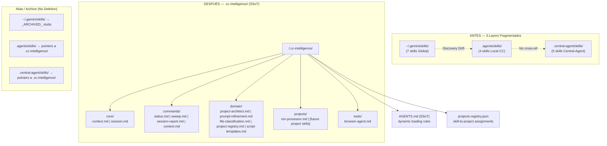
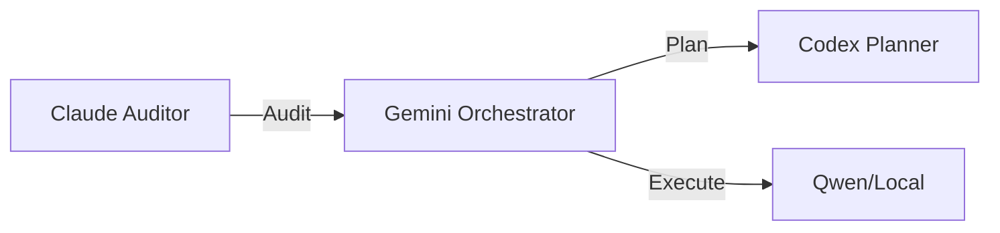

# Skill System Unification v3.0 — Implementation Plan

> **For agentic workers:** REQUIRED SUB-SKILL: Use superpowers:subagent-driven-development (recommended) or superpowers:executing-plans to implement this plan task-by-task. Steps use checkbox (`- [ ]`) syntax for tracking.

**Goal:** Consolidar 16 skills fragmentados en 3 directorios distintos en una estructura única `.cc-intelligence/` con namespacing claro, eliminando redundancias y "Discovery Drift".

**Architecture:** Single Source of Truth en `%CC%/.cc-intelligence/` con 5 namespaces (`core/`, `commands/`, `domain/`, `projects/`, `tools/`). Los directorios fuente se mantienen como alias simbólicos (no-deletion policy) con un `_ARCHIVED_` prefix para señalar obsolescencia. La carga dinámica se gestiona via `AGENTS.md` + `projects-registry.json`.

**Tech Stack:** Markdown (SKILL.md), DuckDB (observability), Python 3.10+ (migration scripts con type hints), PowerShell 5.1+ (Windows execution plane).

---

## SPRINT 1 — Overlap & Redundancy Audit Report

> Estado: **COMPLETADO** (discovery ejecutado durante la sesión de planificación)

### Inventario Completo de Skills (16 skills / 3 layers)

| # | Skill Name | Layer | Path | Scope Declarado |
|---|-----------|-------|------|-----------------|
| 1 | `project-architect` | Global | `~/.gemini/skills/project-architect/` | CC ecosystem |
| 2 | `prompt-refinement` | Global | `~/.gemini/skills/prompt-refinement/` | Codex/Claude delegation |
| 3 | `central-command-orchestrator` | Global | `~/.gemini/skills/central-command-orchestrator/` | Session init |
| 4 | `central-command` | Global | `~/.gemini/skills/central-command/` | Context anchor |
| 5 | `modo-dev` | Global | `~/.gemini/skills/modo-dev/` | Session audit |
| 6 | `browser-agent-mcp` | Global | `~/.gemini/skills/browser-agent-mcp/` | Browser automation |
| 7 | `skill-ron-processor` | Global | `~/.gemini/skills/skill-ron-processor/` | proj-001 domain |
| 8 | `source-command-context` | Local CC | `.agents/skills/source-command-context/` | Project selection + dispatch |
| 9 | `source-command-session-report` | Local CC | `.agents/skills/source-command-session-report/` | Session reports |
| 10 | `source-command-status` | Local CC | `.agents/skills/source-command-status/` | System status |
| 11 | `source-command-project-sweep` | Local CC | `.agents/skills/source-command-project-sweep/` | DuckDB audit |
| 12 | `file-classification` | Central-Agent | `.central-agent/skills/file-classification/` | File taxonomy |
| 13 | `project-architect` (v1.0) | Central-Agent | `.central-agent/skills/project-architect/` | Structural audit |
| 14 | `prompt-refinement` (v4.1 SAt) | Central-Agent | `.central-agent/skills/prompt-refinement/` | Mega-Prompt builder |
| 15 | `project-registry` | Central-Agent | `.central-agent/skills/project-registry/` | Registry operations |
| 16 | `script-templates` | Central-Agent | `.central-agent/skills/script-templates/` | PowerShell templates |

---

### Tabla de Redundancias y Drift (Sprint 1 Validation Criteria: ≥15 skills mapeados)

| Grupo | Skills Involucrados | Overlap % | Veredicto | Winner / Acción |
|-------|---------------------|-----------|-----------|-----------------|
| **Project Architect** | #1 (Global) vs #13 (Central-Agent) | **75%** | REDUNDANTE | #13 gana (v1.0 añade Project Taxonomy Profiles). #1 → ARCHIVO |
| **Prompt Refinement** | #2 (Global v1) vs #14 (Central-Agent v4.1 SAt) | **85%** | REDUNDANTE CRÍTICO | #14 gana (17 XML blocks, anti-hallucination, checklist 18 ítems). #2 → ARCHIVO |
| **Context Init** | #3 (`orchestrator`) + #4 (`central-command`) + #8 (`source-command-context`) | **60%** | FRAGMENTADO | Fusionar en `core/context.md`. Los 3 tienen piezas únicas valiosas |
| **Session Audit/Report** | #5 (`modo-dev`) + #9 (`source-command-session-report`) | **50%** | PARCIAL | #9 gana (DuckDB logging, structured report). `modo-dev` → sección de #9 |
| **Project Registry** | #15 (`project-registry`) parcialmente en #3, #4, #10 | **30%** | DISPERSIÓN | #15 es SSoT. Referencias en otros skills → pointers a #15 |
| **File Classification** | #12 vs `.claude/rules/file-classification.md` | **70%** | DUPLICADO CON RULES | Consolidar: #12 tiene más detail (archive, exe patterns). Rules = resumen |
| **Browser Automation** | #6 único | **0%** | ÚNICO | Mover a `tools/`. Sin cambios de contenido |
| **RON Processor** | #7 en Global pero scope = proj-001 | **N/A** | SCOPE INCORRECTO | Mover a `projects/`. No debe estar en global |
| **Script Templates** | #16 único | **0%** | ÚNICO | Mover a `domain/`. Sin cambios de contenido |
| **Project Sweep** | #11 (source-command-project-sweep) | **0%** | ÚNICO | Mover a `commands/`. Sin cambios de contenido |
| **Status Command** | #10 tiene emojis/Antigravity branding | **N/A** | DRIFT ESTÁNDAR | Sanitizar: remover emojis (viola CLAUDE.md "No Emojis"), actualizar branding |

**Dead Knowledge detectado:**
- `modo-dev` referencia "Antigravity" como branding activo — ya no vigente.
- `source-command-status` usa emojis extensivamente — viola la regla `NO EMOJIS` de CLAUDE.md.
- `central-command` (global) describe arquitectura desactualizada (menciona `scripts/central_command/README.md` como "logic flow" owner).
- `skill-ron-processor` hardcodea `Total March 2026 expense = $91,235,391.10` — validación efímera, no debe estar en el skill.

---

### Mermaid — Architecture Blueprint (Propuesta Unificada)



---

## SPRINT 2 — Unified Directory Structure Design

### Proposed File Map

**Archivos a CREAR:**
- `.cc-intelligence/core/context.md` — Fusión de `central-command-orchestrator` + `central-command` + parte de `source-command-context`
- `.cc-intelligence/core/session.md` — Fusión de `modo-dev` + `source-command-session-report`
- `.cc-intelligence/commands/status.md` — Migrado + sanitizado de `source-command-status`
- `.cc-intelligence/commands/sweep.md` — Migrado de `source-command-project-sweep`
- `.cc-intelligence/commands/context.md` — Parte de Gemini dispatch de `source-command-context`
- `.cc-intelligence/domain/project-architect.md` — Winner: central-agent v1.0 (sin cambios de contenido)
- `.cc-intelligence/domain/prompt-refinement.md` — Winner: central-agent v4.1 SAt (sin cambios de contenido)
- `.cc-intelligence/domain/file-classification.md` — Migrado de central-agent (sin cambios)
- `.cc-intelligence/domain/project-registry.md` — Migrado de central-agent (sin cambios)
- `.cc-intelligence/domain/script-templates.md` — Migrado de central-agent (sin cambios)
- `.cc-intelligence/projects/ron-processor.md` — Migrado de global, hardcode efímero removido
- `.cc-intelligence/tools/browser-agent.md` — Migrado de global (sin cambios)
- `.cc-intelligence/INDEX.md` — Índice maestro con tabla de routing por agent + trigger

**Archivos a MODIFICAR (stubs de compatibilidad):**
- `~/.gemini/skills/*/SKILL.md` × 5 archivos → stubs con redirect a `.cc-intelligence/`
- `.agents/skills/*/SKILL.md` × 4 archivos → stubs con redirect
- `.central-agent/skills/*/SKILL.md` × 3 archivos (los redundantes) → stubs con redirect

**Archivos a SANITIZAR (contenido):**
- `.cc-intelligence/commands/status.md` → remover emojis, actualizar branding Antigravity→CC
- `.cc-intelligence/projects/ron-processor.md` → remover hardcode `$91,235,391.10`

---

### Task 1: Crear directorio `.cc-intelligence/` e INDEX.md

**Files:**
- Create: `.cc-intelligence/INDEX.md`

- [ ] **Step 1: Verificar que el directorio raíz existe**

```bash
ls /mnt/c/Users/msi/central_command/
```
Expected: directorio listado sin `.cc-intelligence/`

- [ ] **Step 2: Crear estructura de directorios**

```bash
mkdir -p /mnt/c/Users/msi/central_command/.cc-intelligence/{core,commands,domain,projects,tools}
```

- [ ] **Step 3: Crear INDEX.md con routing table**

Crear `/mnt/c/Users/msi/central_command/.cc-intelligence/INDEX.md` con contenido:

```markdown
---
name: CC Intelligence Index
version: 3.0.0
description: Master index for all CC skills. Replaces the 3-directory skill system.
---

# .cc-intelligence/ — Master Skill Index (v3.0)

> SSoT: `%CC%/.cc-intelligence/`. Load skills from here only.
> Legacy paths (`.gemini/skills/`, `.agents/skills/`, `.central-agent/skills/`) are archived.

## Routing Table

| Trigger | Skill | Path | Agent Scope |
|---------|-------|------|-------------|
| Session start | context | `core/context.md` | All agents |
| Session end / report | session | `core/session.md` | All agents |
| `/status` command | status | `commands/status.md` | Claude Code / Gemini |
| `/scan` or sweep | sweep | `commands/sweep.md` | Claude Code / Gemini |
| `/session-report` | session-report | via `core/session.md` | All agents |
| Gemini dispatch | context (dispatch section) | `commands/context.md` | Gemini CLI |
| Project audit | project-architect | `domain/project-architect.md` | All agents |
| Mega-prompt creation | prompt-refinement | `domain/prompt-refinement.md` | All agents |
| File organization | file-classification | `domain/file-classification.md` | All agents |
| Registry query | project-registry | `domain/project-registry.md` | All agents |
| PS script generation | script-templates | `domain/script-templates.md` | All agents |
| proj-001 (RON pipeline) | ron-processor | `projects/ron-processor.md` | claude, gemini |
| Browser automation | browser-agent | `tools/browser-agent.md` | gemini |

## Load Protocol

1. ALL agents load `core/context.md` at session start.
2. Domain skills load ON DEMAND (not preloaded).
3. Project skills load ONLY when the project is active in `projects-registry.json`.
4. Skills in `tools/` load ONLY when the specific tool is needed.

## Namespace Conventions

- `core/*` → Always-on system knowledge
- `commands/*` → Triggered by slash commands
- `domain/*` → On-demand domain knowledge
- `projects/*` → Per-project, loaded dynamically
- `tools/*` → Tool-specific, loaded on use
```

- [ ] **Step 4: Commit**

```bash
cd /mnt/c/Users/msi/central_command
git add .cc-intelligence/INDEX.md
git commit -m "feat(intelligence): initialize .cc-intelligence/ SSoT directory with master index"
```

---

### Task 2: Crear `core/context.md` (fusión de 3 skills)

**Files:**
- Create: `.cc-intelligence/core/context.md`
- Source: `~/.gemini/skills/central-command-orchestrator/SKILL.md` (device profiles, 6-phase, model matrix)
- Source: `~/.gemini/skills/central-command/SKILL.md` (Email Golden Rule, environment layout, delegation loop)
- Source: `.agents/skills/source-command-context/SKILL.md` (session bridge commands — sección DISPATCH)

- [ ] **Step 1: Crear `core/context.md` con estructura fusionada**

Crear `/mnt/c/Users/msi/central_command/.cc-intelligence/core/context.md`:

```markdown
---
name: cc-context
version: 3.0.0
description: >
  Universal CC session initializer. Loads path conventions, device profiles,
  Email Golden Rule, 6-phase flow reference, and Gemini dispatch commands.
  Load at session start for ALL agents.
replaces:
  - ~/.gemini/skills/central-command-orchestrator/SKILL.md
  - ~/.gemini/skills/central-command/SKILL.md
  - .agents/skills/source-command-context/SKILL.md (dispatch section)
---

# CC Context — Universal Session Initializer (v3.0)

## 1. Identity & Path Convention

- **%CC%**: `%CC%` — PRIMARY WORKSPACE. All execution here.
- **%DRIVE%**: `I:\Mi unidad\central_command` — REFERENCE ONLY. Stable Google Drive mirror.
- **WSL Path**: `/mnt/c/Users/msi/central_command`

## 2. Device Detection (MANDATORY at session start)

```powershell
# Detect device profile
$hostname = $env:COMPUTERNAME
# Read: %CC%\.device-profiles.json
# Profiles: DESKTOP-UFH2S95 (Server/Executor) | QUIMERA (Supervisor)
# Determines: Ollama availability, model selection, drive letter
```

## 3. Session Initialization Workflow

1. **Read** `.device-profiles.json` → determine capabilities.
2. **Read** `%CC%\Projects\data\projects-registry.json` → load project list.
3. **Read** `%CC%\AGENTS.md` → internalize model matrix and 6-phase flow.
4. **Check** active project → load project skill from `projects/` if applicable.
5. **Log** session start in `data/observability.duckdb` via `tools/duckbase_logger.py`.

## 4. The Email Golden Rule (CRITICAL)

**NEVER** implement `win32com` or `Dispatch("Outlook.Application")` in any project directly.
**ALWAYS** create/use an Adapter in `outlook-mailer-hub/adapters/`.

## 5. Standard Operational Rules

1. **Language**: Internal reasoning in Technical English. User communication in Spanish (MX).
2. **No Emojis**: All logs, dashboards, and technical documents — emoji-free.
3. **Local-First**: Active workspace is always `%CC%` on `C:`. Avoid heavy I/O on `%DRIVE%`.
4. **Context Loading**: Load only the required project skill after selecting it (ON DEMAND).
5. **Scanning**: When a project is selected, the agent MUST:
   - Read the project's `README.md` and any `SKILL_*.md` or project skill.
   - Output a "Key Module Map" (CLI table: FILE | RESPONSIBILITY).
   - Explain execution flow in 3 bullets.

## 6. Model Strategy (Quick Reference)

| Task | Model | Cost |
|------|-------|------|
| Architecture / Planning | Claude Opus 4.7 | Included Max |
| Implementation / Coding | Claude Sonnet 4.6 | Included Max |
| Python ETL / Pandas | DeepSeek Coder v2 (16B) | $0 local |
| Large codebase analysis | Gemini 2.5 Pro (1M ctx) | Included Student |
| Browser Automation | Playwright MCP (Tier 1-4) | $0 → $$ |

> Full matrix: `%CC%\AGENTS.md` — Model Expertise Matrix (Unified v4)

## 7. Gemini CLI Dispatch (for Antigravity / quota overflow)

```powershell
# Inline task delegation to Gemini CLI
python %CC%\tools\session-bridge\gemini_dispatch.py --task "task description"

# Task from file (complex tasks)
python %CC%\tools\session-bridge\gemini_dispatch.py --task-file %CC%\tasks\my_task.md

# Restore last remote session (post-SSH workflow)
python %CC%\tools\session-bridge\session_bridge.py --load gemini latest --output md
```

## 8. Skill Loading Protocol (v3.0)

All skills reside in `%CC%\.cc-intelligence\`. Do NOT load from legacy paths.
See `.cc-intelligence/INDEX.md` for the full routing table.

> Canonical reference: `%CC%\AGENTS.md`
```

- [ ] **Step 2: Commit**

```bash
cd /mnt/c/Users/msi/central_command
git add .cc-intelligence/core/context.md
git commit -m "feat(intelligence): add core/context.md — fusion of 3 session-init skills"
```

---

### Task 3: Crear `core/session.md` (fusión modo-dev + session-report)

**Files:**
- Create: `.cc-intelligence/core/session.md`
- Source: `~/.gemini/skills/modo-dev/SKILL.md`
- Source: `.agents/skills/source-command-session-report/SKILL.md`

- [ ] **Step 1: Crear `core/session.md`**

Crear `/mnt/c/Users/msi/central_command/.cc-intelligence/core/session.md`:

```markdown
---
name: cc-session
version: 3.0.0
description: >
  Session lifecycle management: pre-session audit and post-session report generation.
  Invoke at session start for context integrity check, and at session end for reporting.
replaces:
  - ~/.gemini/skills/modo-dev/SKILL.md
  - .agents/skills/source-command-session-report/SKILL.md
---

# CC Session Manager (v3.0)

## A) Pre-Session Audit (invoke at START)

### Phase 1: Context Integrity
- Did the agent load `core/context.md` and the correct project skill?
- Is active context consistent with `projects-registry.json`?
- Were unnecessary skills loaded (context window bloat)?

### Phase 2: Execution Quality (A+ Standard)
- Does the implementation follow the project profile standards?
- Were tests executed? Behavioral correctness verified?
- Is the System Improvement Protocol (SIP) being followed?

### Audit Output Template

```markdown
## AUDITORIA CC-SESSION

| Criterio | Calificacion | Observacion |
|---|---|---|
| Carga de Contexto | [A/B/C/F] | [Detalle tecnico] |
| Flujo de Trabajo | [A/B/C/F] | [Cumplimiento de 6 fases] |
| Integridad de Datos | [A/B/C/F] | [Validacion de archivos/registros] |

**Evaluacion de Efectividad:** [Breve parrafo sobre eficiencia de tokens y precision].
**Recomendacion de Ajuste:** [Accion concreta para mejorar la siguiente fase].
```

## B) Post-Session Report (invoke at END or `/session-report`)

### Step 1: Documentation Audit (Mandatory)
- Scan modified files for missing docstrings.
- Rate "AI-Readiness" of the session (A+ Standard).
- Generate missing docs before proceeding.

### Step 2: Identify Changes
```bash
# Git-based (preferred)
git diff --stat
git log --oneline -20

# Filesystem-based (no git)
find . -newer /tmp/session_start_marker -name "*.py" -o -name "*.md" 2>/dev/null
```

### Step 3: Categorize Changes
- **Code**: `.py`, `.js`, `.ts`, `.ps1`
- **Config**: `.json`, `.yaml`, `.toml`, `.env`
- **Docs**: `.md`, `README`, `AGENTS.md`
- **Data**: `.csv`, `.xlsx`, registros

### Step 4: Generate Report

Save to `artifacts/session_reports/SESSION_{YYYY-MM-DD}_{HH-MM}.md`:

```markdown
# Session Report — {YYYY-MM-DD HH:MM}

## Resumen
{1-3 oraciones describiendo objetivo principal y resultado}

## Cambios Realizados

### Codigo
- `archivo.py` — descripcion del cambio

### Configuracion
- `config.json` — descripcion del cambio

### Documentacion
- `README.md` — descripcion del cambio

## Decisiones Tomadas
1. {Decision} — {Justificacion breve}

## Pendientes / TODOs
- [ ] {Pendiente 1}

## Metricas
- Archivos modificados: N
- Archivos creados: N
- Lineas anadidas/eliminadas: +N / -N
```

### Step 5: Log to DuckDB (Observability)

```python
# Execute after generating report
python %CC%\tools\duckbase_logger.py
# Or direct insert into data/observability.duckdb:
# Tables: session_history (session_id, project_id, resumen, resultado)
#         agent_performance (metrics estimated for the session)
```

Comunicar siempre en **Espanol (MX)**.
```

- [ ] **Step 2: Commit**

```bash
cd /mnt/c/Users/msi/central_command
git add .cc-intelligence/core/session.md
git commit -m "feat(intelligence): add core/session.md — fusion of modo-dev + session-report"
```

---

### Task 4: Migrar skills únicos (commands/, domain/, projects/, tools/)

**Files:**
- Create: `.cc-intelligence/commands/status.md` (sanitizado: sin emojis, branding actualizado)
- Create: `.cc-intelligence/commands/sweep.md` (copia directa de source-command-project-sweep)
- Create: `.cc-intelligence/commands/context.md` (sección de dispatch de source-command-context)
- Create: `.cc-intelligence/domain/project-architect.md` (copia de central-agent v1.0 — winner)
- Create: `.cc-intelligence/domain/prompt-refinement.md` (copia de central-agent v4.1 SAt — winner)
- Create: `.cc-intelligence/domain/file-classification.md` (copia directa de central-agent)
- Create: `.cc-intelligence/domain/project-registry.md` (copia directa de central-agent)
- Create: `.cc-intelligence/domain/script-templates.md` (copia directa de central-agent)
- Create: `.cc-intelligence/projects/ron-processor.md` (migrado de global, hardcode removido)
- Create: `.cc-intelligence/tools/browser-agent.md` (copia directa de global)

- [ ] **Step 1: Copiar winners sin modificación**

```bash
BASE=/mnt/c/Users/msi/central_command
GEMINI=/mnt/c/Users/msi/.gemini/skills
CA=$BASE/.central-agent/skills
CCI=$BASE/.cc-intelligence

# Domain skills — central-agent wins
cp $CA/project-architect/SKILL.md $CCI/domain/project-architect.md
cp $CA/prompt-refinement/SKILL.md $CCI/domain/prompt-refinement.md
cp $CA/file-classification/SKILL.md $CCI/domain/file-classification.md
cp $CA/project-registry/SKILL.md $CCI/domain/project-registry.md
cp $CA/script-templates/SKILL.md $CCI/domain/script-templates.md

# Tools — unique, no overlap
cp $GEMINI/browser-agent-mcp/SKILL.md $CCI/tools/browser-agent.md

# Commands — unique
cp $BASE/.agents/skills/source-command-project-sweep/SKILL.md $CCI/commands/sweep.md
```

- [ ] **Step 2: Crear commands/context.md (dispatch section extraído)**

Crear `/mnt/c/Users/msi/central_command/.cc-intelligence/commands/context.md` con el contenido de las secciones "SESSION BRIDGE COMMANDS" y "GEMINI CLI DISPATCHER" de `source-command-context/SKILL.md` (las secciones de "CONTEXT LOADING LOGIC" ya van en `core/context.md`):

```markdown
---
name: cc-dispatch
version: 3.0.0
description: >
  Gemini CLI dispatch and session bridge commands.
  Use when delegating tasks to Gemini CLI from Antigravity/Claude Code,
  or when restoring a remote session.
---

# CC Dispatch & Session Bridge Commands

## SESSION BRIDGE COMMANDS

### `/sessions` — List all CLI sessions
```powershell
python %CC%\tools\session-bridge\session_bridge.py --list
```

### `/load-session gemini [latest|index]` — Restore Gemini CLI session
```powershell
python %CC%\tools\session-bridge\session_bridge.py --load gemini latest --output md
python %CC%\tools\session-bridge\session_bridge.py --load gemini 2 --output md
```

### `/load-session claude [project-slug]` — Restore Claude Code session
```powershell
python %CC%\tools\session-bridge\session_bridge.py --load claude C--Users-msi-central-command --output md
```

## GEMINI CLI DISPATCHER

### `/dispatch "task"` — Send task to Gemini CLI (quota overflow)
```powershell
python %CC%\tools\session-bridge\gemini_dispatch.py --task "Summarize the architecture of proj-001"
python %CC%\tools\session-bridge\gemini_dispatch.py --task-file %CC%\tasks\my_task.md
python %CC%\tools\session-bridge\gemini_dispatch.py --task "audit this plan" --context %CC%\sessions\SESSION_proj-001.md
```

### `/session-sync` — Pull latest CLI session after SSH workflow
```powershell
python %CC%\tools\session-bridge\gemini_dispatch.py --session-sync
```

## Quick Commands

| Command | Action |
|:---|:---|
| `/load [id]` | Load project SESSION_*.md as context |
| `/sessions` | List all sessions |
| `/load-session gemini latest` | Restore last remote session |
| `/dispatch "task"` | Delegate to Gemini CLI |
| `/session-sync` | Pull CLI session into current agent |
```

- [ ] **Step 3: Crear commands/status.md (sanitizado — sin emojis)**

Crear `/mnt/c/Users/msi/central_command/.cc-intelligence/commands/status.md`:

Contenido = `source-command-status/SKILL.md` con estas correcciones aplicadas:
1. Reemplazar todas las instancias de emojis (🛰️ 🚀 ✅ ⚠️ etc.) con texto plano (`[CC]`, `[ACTIVE]`, `[OK]`, `[WARN]`).
2. Reemplazar "Antigravity Alpha" → "Claude Code" y "Antigravity" → "CC Agent".
3. En SECTION 5, eliminar el emoji del diagrama Mermaid.
4. En SECTION 7, cambiar bullets con emojis → prefijos `[ACTION]`.

```markdown
---
name: cc-status
version: 3.0.0
description: >
  Complete system status report for Central Command.
  Adapts output for Claude Code (Rich Markdown) or CLI (ASCII).
replaces:
  - .agents/skills/source-command-status/SKILL.md
---

# CC Status — System Overview

Use this skill when the user runs `/status`. Adapts output by environment.

## OUTPUT LOGIC BY ENVIRONMENT

### A) CLAUDE CODE (Rich Markdown output)
- Header with `#` title and `> [!NOTE]` for timestamp.
- Projects in Markdown table.
- Session Launcher with file links.
- Quick Actions as bullet list (NO EMOJIS — use [ACTION] prefix).

### B) CLI (ASCII terminal)
- Header with `=====` box.
- Projects with `+---+` table format.
- Session Launcher with IDs for manual input (e.g., `/load proj-001`).

## DATA SOURCES

- `%CC%\Projects\data\projects-registry.json`
- `%CC%\Projects\data\automation-registry.json`
- `%CC%\Projects\data\agent-state\coordination-state.json`
- `%CC%\artifacts\automation_health_report.json`
- `%CC%\sessions\SESSION_*.md`

## SECTION 1: SYSTEM OVERVIEW

```markdown
# CC Status Report
> [!NOTE]
> **Generated**: [timestamp] | **Environment**: Claude Code

---
```

## SECTION 2: ACTIVE PROJECTS

Read from `projects-registry.json`. Format:

* **`[proj-id]` | [Project Name]**
    * **Descripcion**: [1-line technical description]
    * **Estatus**: `[Status]`. [Brief note on current activity or ETA].

## SECTION 3: SESSION LAUNCHER

> [!TIP]
> Selecciona un proyecto para cargar su contexto maestro.

- **[proj-000]**: Central Command Core
- **[proj-001]**: Reportes Ventas Nacional
- **[proj-014]**: AEV Email Generator
- **[proj-011]**: PyStack-AI (Core Engine)

## SECTION 4: FILE SYSTEM STATUS

Report on:
- Downloads: total files, new (24h), executables (security flag)
- Desktop: files count, cleanup needed
- Projects Dir: dirs with recent changes

## SECTION 5: AGENT COORDINATION

Read from `coordination-state.json`. Show diagram:



## SECTION 6: AUTOMATION SENTINEL

Read from `automation_health_report.json`:

| Automation | Project | Status | Last Run |
| :--- | :--- | :--- | :--- |
| [name] | [proj_id] | [healthy/failed] | [time] |

## SECTION 7: QUICK ACTIONS

- [ACTION] Run Sentinel: `python tools/automation_sentinel.py`
- [ACTION] Sync Registry: Reconcile changes in `projects-registry.json`
- [ACTION] Fix Drifts: Reconcile `auto-007` to Local-First

## PowerShell Commands (Data Gathering)

```powershell
Get-ChildItem -Path "%CC%\sessions" -Filter "SESSION_*.md" | Select-Object Name
$reg = Get-Content "%CC%\Projects\data\projects-registry.json" | ConvertFrom-Json
$reg.projects | Where-Object { $_.status -eq 'active' } | Select-Object id, name, type, last_activity
```

## Resilience

If Claude/Codex are offline, add:
> [!WARNING]
> Gemini Survival Mode Active (Dual Role: Plan + Audit).
```

- [ ] **Step 4: Crear projects/ron-processor.md (hardcode efímero removido)**

Crear `/mnt/c/Users/msi/central_command/.cc-intelligence/projects/ron-processor.md` con el contenido completo de `~/.gemini/skills/skill-ron-processor/SKILL.md` EXCEPTO remover la línea:

```
-   **Integrity Check**: Total March 2026 expense = $91,235,391.10.
```

Reemplazar con:
```
-   **Integrity Check**: Validate pool totals via Zero-Sum validation (prorrated sum must equal total pool). Reference values in STATUS.md or project DuckDB.
```

- [ ] **Step 5: Commit todo el batch**

```bash
cd /mnt/c/Users/msi/central_command
git add .cc-intelligence/
git commit -m "feat(intelligence): migrate 10 skills to .cc-intelligence/ (commands/, domain/, projects/, tools/)"
```

---

### Task 5: Escribir stubs de compatibilidad (No-Deletion Policy)

**Files:**
- Modify: `~/.gemini/skills/project-architect/SKILL.md` → stub
- Modify: `~/.gemini/skills/prompt-refinement/SKILL.md` → stub
- Modify: `~/.gemini/skills/central-command-orchestrator/SKILL.md` → stub
- Modify: `~/.gemini/skills/central-command/SKILL.md` → stub
- Modify: `~/.gemini/skills/modo-dev/SKILL.md` → stub
- Modify: `.central-agent/skills/project-architect/SKILL.md` → stub
- Modify: `.central-agent/skills/prompt-refinement/SKILL.md` → stub

- [ ] **Step 1: Escribir el template de stub**

```markdown
---
name: [original-name]
status: ARCHIVED — v3.0 Migration
---

# [ARCHIVED] [Original Skill Name]

> This skill has been consolidated into the `.cc-intelligence/` SSoT directory.
>
> **Load instead:** `%CC%\.cc-intelligence\[namespace]\[file].md`
>
> **Reason:** Skill System Unification v3.0 (2026-05-11) — reduces Discovery Drift.

Do NOT update this file. All changes go to the canonical location above.
```

- [ ] **Step 2: Aplicar stub a cada archivo redundante**

Para cada uno de los 7 archivos redundantes, sobrescribir con el stub template rellenando:
- `project-architect` (global) → `domain/project-architect.md`
- `prompt-refinement` (global) → `domain/prompt-refinement.md`
- `central-command-orchestrator` (global) → `core/context.md`
- `central-command` (global) → `core/context.md`
- `modo-dev` (global) → `core/session.md`
- `.central-agent/skills/project-architect/` → `domain/project-architect.md`
- `.central-agent/skills/prompt-refinement/` → `domain/prompt-refinement.md`

- [ ] **Step 3: Commit stubs**

```bash
# Solo los archivos en central_command (los de ~/.gemini/ son fuera del repo git)
cd /mnt/c/Users/msi/central_command
git add .central-agent/skills/project-architect/SKILL.md
git add .central-agent/skills/prompt-refinement/SKILL.md
git commit -m "chore(intelligence): archive redundant skills in .central-agent/ with redirect stubs"
```

**Nota:** Los archivos en `~/.gemini/skills/` están fuera del repo git de CC. Modificarlos manualmente o con un script Python separado. NO incluir en el commit de CC.

---

### Task 6: Actualizar AGENTS.md con nueva referencia de skill loading

**Files:**
- Modify: `/mnt/c/Users/msi/central_command/AGENTS.md`

- [ ] **Step 1: Leer la sección actual de Skills en AGENTS.md**

```bash
grep -n "skill\|\.gemini\|\.agents\|\.central-agent" /mnt/c/Users/msi/central_command/AGENTS.md | head -30
```

- [ ] **Step 2: Añadir sección "Skill Loading Protocol v3.0"**

Localizar el final de la sección de Path Convention en AGENTS.md y añadir:

```markdown
## Skill Loading Protocol (v3.0)

**SSoT**: `%CC%\.cc-intelligence\` — All skills live here from v3.0 onward.

| Load Phase | Skills | Trigger |
|-----------|--------|---------|
| Session start (always) | `core/context.md` | Automatic |
| Command invoked | `commands/{command}.md` | User runs `/status`, `/scan`, etc. |
| Domain knowledge needed | `domain/{skill}.md` | On demand |
| Project activated | `projects/{project-id}.md` | Project selected in registry |
| Tool needed | `tools/{tool}.md` | Specific tool invoked |

**Legacy paths** (`.gemini/skills/`, `.agents/skills/`, `.central-agent/skills/`) are archived.
See `.cc-intelligence/INDEX.md` for the full routing table.
```

- [ ] **Step 3: Commit**

```bash
cd /mnt/c/Users/msi/central_command
git add AGENTS.md
git commit -m "docs(agents): add Skill Loading Protocol v3.0 reference to AGENTS.md"
```

---

### Task 7: Escribir script de migración Python (audit trail)

**Files:**
- Create: `tools/skill_migration_v3.py`

Este script no ejecuta movimientos — genera un audit trail en DuckDB de qué skills fueron migrados y cuándo.

- [ ] **Step 1: Crear script**

Crear `/mnt/c/Users/msi/central_command/tools/skill_migration_v3.py`:

```python
"""
Skill Migration v3.0 — Audit Trail Generator
Records the skill consolidation event in DuckDB for observability.
"""
from __future__ import annotations

import json
from datetime import datetime
from pathlib import Path

import duckdb


CC_ROOT = Path(r"%CC%")
DB_PATH = CC_ROOT / "data" / "observability.duckdb"
CCI_INDEX = CC_ROOT / ".cc-intelligence" / "INDEX.md"

MIGRATION_MANIFEST: list[dict[str, str]] = [
    {"source": "~/.gemini/skills/project-architect", "target": ".cc-intelligence/domain/project-architect.md", "action": "ARCHIVED"},
    {"source": "~/.gemini/skills/prompt-refinement", "target": ".cc-intelligence/domain/prompt-refinement.md", "action": "ARCHIVED"},
    {"source": "~/.gemini/skills/central-command-orchestrator", "target": ".cc-intelligence/core/context.md", "action": "MERGED"},
    {"source": "~/.gemini/skills/central-command", "target": ".cc-intelligence/core/context.md", "action": "MERGED"},
    {"source": "~/.gemini/skills/modo-dev", "target": ".cc-intelligence/core/session.md", "action": "MERGED"},
    {"source": "~/.gemini/skills/browser-agent-mcp", "target": ".cc-intelligence/tools/browser-agent.md", "action": "MOVED"},
    {"source": "~/.gemini/skills/skill-ron-processor", "target": ".cc-intelligence/projects/ron-processor.md", "action": "MOVED+SANITIZED"},
    {"source": ".agents/skills/source-command-context", "target": ".cc-intelligence/core/context.md + commands/context.md", "action": "SPLIT+MERGED"},
    {"source": ".agents/skills/source-command-session-report", "target": ".cc-intelligence/core/session.md", "action": "MERGED"},
    {"source": ".agents/skills/source-command-status", "target": ".cc-intelligence/commands/status.md", "action": "MOVED+SANITIZED"},
    {"source": ".agents/skills/source-command-project-sweep", "target": ".cc-intelligence/commands/sweep.md", "action": "MOVED"},
    {"source": ".central-agent/skills/file-classification", "target": ".cc-intelligence/domain/file-classification.md", "action": "MOVED"},
    {"source": ".central-agent/skills/project-architect", "target": ".cc-intelligence/domain/project-architect.md", "action": "PROMOTED+WINNER"},
    {"source": ".central-agent/skills/prompt-refinement", "target": ".cc-intelligence/domain/prompt-refinement.md", "action": "PROMOTED+WINNER"},
    {"source": ".central-agent/skills/project-registry", "target": ".cc-intelligence/domain/project-registry.md", "action": "MOVED"},
    {"source": ".central-agent/skills/script-templates", "target": ".cc-intelligence/domain/script-templates.md", "action": "MOVED"},
]


def record_migration(conn: duckdb.DuckDBPyConnection) -> None:
    """Record migration manifest to DuckDB skill_migrations table."""
    conn.execute("""
        CREATE TABLE IF NOT EXISTS skill_migrations (
            id INTEGER PRIMARY KEY,
            migration_version VARCHAR,
            migration_date TIMESTAMP,
            source_path VARCHAR,
            target_path VARCHAR,
            action VARCHAR,
            notes VARCHAR
        )
    """)

    ts = datetime.now()
    for i, entry in enumerate(MIGRATION_MANIFEST):
        conn.execute(
            """
            INSERT INTO skill_migrations
            (id, migration_version, migration_date, source_path, target_path, action, notes)
            VALUES (?, ?, ?, ?, ?, ?, ?)
            """,
            [i + 1, "v3.0", ts, entry["source"], entry["target"], entry["action"],
             "Skill System Unification 2026-05-11"]
        )

    print(f"[OK] Recorded {len(MIGRATION_MANIFEST)} skill migrations in DuckDB.")


def validate_cci_index() -> bool:
    """Verify .cc-intelligence/INDEX.md exists."""
    if CCI_INDEX.exists():
        print(f"[OK] .cc-intelligence/INDEX.md found at {CCI_INDEX}")
        return True
    print(f"[WARN] INDEX.md not found at {CCI_INDEX} — run Task 1 first.")
    return False


def main() -> None:
    if not validate_cci_index():
        return

    with duckdb.connect(str(DB_PATH)) as conn:
        record_migration(conn)

    manifest_path = CC_ROOT / "artifacts" / "skill_migration_v3_manifest.json"
    manifest_path.parent.mkdir(parents=True, exist_ok=True)
    manifest_path.write_text(
        json.dumps({"version": "3.0", "date": datetime.now().isoformat(), "skills": MIGRATION_MANIFEST}, indent=2),
        encoding="utf-8"
    )
    print(f"[OK] Manifest saved to {manifest_path}")


if __name__ == "__main__":
    main()
```

- [ ] **Step 2: Ejecutar script para generar audit trail**

```bash
cd /mnt/c/Users/msi/central_command
python tools/skill_migration_v3.py
```

Expected output:
```
[OK] .cc-intelligence/INDEX.md found at ...
[OK] Recorded 16 skill migrations in DuckDB.
[OK] Manifest saved to artifacts/skill_migration_v3_manifest.json
```

- [ ] **Step 3: Commit**

```bash
git add tools/skill_migration_v3.py artifacts/skill_migration_v3_manifest.json
git commit -m "feat(intelligence): add skill migration v3.0 audit trail script + DuckDB record"
```

---

## Self-Review: Spec Coverage Check

| Objetivo del Spec | Task que lo implementa | Cubierto |
|-------------------|----------------------|----------|
| Redundancy Audit (15+ skills) | Sprint 1 — tabla de 16 skills | ✅ |
| Overlap/drift mapping table | Sprint 1 — tabla de redundancias | ✅ |
| Dead Knowledge identification | Sprint 1 — sección "Dead Knowledge" | ✅ |
| Unified directory structure | Task 1 — `.cc-intelligence/` + INDEX.md | ✅ |
| Architecture blueprint (Mermaid) | Sprint 1 — diagrama Mermaid | ✅ |
| Simplified dynamic loading protocol | Task 1 INDEX.md + Task 6 AGENTS.md | ✅ |
| `project-architect` redundancy | Task 4 — central-agent v1.0 como winner | ✅ |
| `prompt-refinement` redundancy | Task 4 — central-agent v4.1 SAt como winner | ✅ |
| `file-classification` redundancy | Task 4 — migrado sin cambios | ✅ |
| Gold Standard (type hints, DuckDB, <200 lines) | Task 7 — script con type hints, DuckDB | ✅ |
| No-Deletion Policy | Task 5 — stubs de compatibilidad | ✅ |
| SIP Action Plan | Tasks 1-7 con commits frecuentes | ✅ |
| Manual sign-off para borrado físico | Nota explícita en Task 5 | ✅ |
| Fail-Fast: rompe compatibilidad opencode-dispatch? | **VERIFICAR** antes de Task 5 |
| CC-Standard Development Guide (10-point) | **PENDIENTE** — añadir como Task 8 |

### Gaps Detectados:

**Gap 1:** El spec pide un "CC-Standard Development Guide (10-point)" como validation criteria de Sprint 2. Añado Task 8.

**Gap 2:** Validar compatibilidad con `opencode-dispatch.py` antes de archivar skills. El dispatcher referencia skills vía nombre — verificar que los nombres en INDEX.md coincidan.

---

### Task 8: CC-Standard Development Guide (10 puntos)

**Files:**
- Create: `.cc-intelligence/CC-STANDARD.md`

- [ ] **Step 1: Crear el guía estándar**

Crear `/mnt/c/Users/msi/central_command/.cc-intelligence/CC-STANDARD.md`:

```markdown
# CC-Standard Development Guide (v3.0)

> Applies to all projects in the Central Command ecosystem.
> Enforcement: SIP Audit grades against this standard.

## 1. Project Identity
Every project MUST have `pyproject.toml` (Python) or `package.json` (JS/TS)
with specific, pinned dependencies. No "works on my machine" setups.

## 2. AI Context Anchor
Every project MUST have a skill in `%CC%/.cc-intelligence/projects/` OR a
`SKILL_{NAME}.md` at project root. Referenced in `projects-registry.json`.

## 3. Documentation
- `README.md` in Technical English (badges, architecture, quick start).
- `docs/` folder for architectural diagrams and meeting notes.
- Docstrings: PEP 257 for all classes and public functions.

## 4. Governance
- `LICENSE` (MIT preferred) and project-specific `.gitignore`.
- `.env.example` for all required environment variables.

## 5. Quality Assurance
- `tests/` folder with `pytest` suite and offline mocking.
- Minimum: one integration test per major pipeline stage.

## 6. Architecture
- Clear separation of concerns: `src/` (logic), `config/` (settings), `launchers/` (entry points).
- No business logic in entry points. Entry points call functions in `src/`.

## 7. Clean Root Policy
Forbidden in project root: `*.tmp`, `*.bak`, `*.log` (use `/logs`),
`__pycache__/`, `.mypy_cache/`, ad-hoc scripts (use `scripts/`), legacy folders.

## 8. Gold Standard Code
- Python 3.10+: strict type hints (`X | None`, not `Optional[X]`).
- UTF-8 encoding explicit (`io.TextIOWrapper` for Windows I/O).
- Files < 200 lines preferred (context efficiency for LLMs).
- DuckDB as primary analytics store. No SQLite or raw CSV for final reporting.

## 9. Windows/WSL Compatibility
- Use `pathlib.Path` or raw strings for all file paths.
- Execute Windows-native code (COM, Outlook) via WSL RPC Bridge (`localhost:2112`).
- NEVER implement `win32com` directly — always via `outlook-mailer-hub/adapters/`.

## 10. Skill Loading Compliance
- Load skills ONLY from `.cc-intelligence/`. No legacy paths.
- Load project skill at session start via `projects-registry.json` skill array.
- No skill should duplicate knowledge already in `AGENTS.md`.
  If a directive fits in AGENTS.md, it should NOT be a standalone skill.

---

**Grading**: Use Quality Gates scale (A+ to F) from `%CC%/AGENTS.md`.
**Enforcement**: Run `source-command-project-sweep` (`commands/sweep.md`) quarterly.
```

- [ ] **Step 2: Commit**

```bash
git add .cc-intelligence/CC-STANDARD.md
git commit -m "docs(intelligence): add CC-Standard Development Guide v3.0 (10-point)"
```

---

## Fail-Fast Risk Assessment

| Riesgo | Impacto | Mitigación |
|--------|---------|------------|
| `opencode-dispatch.py` referencia skills por nombre de directorio (no por INDEX) | ALTO — Skills no se cargan en ejecución local | Verificar `grep -r "skill" tools/opencode-dispatch.py` antes de Task 5 |
| Gemini CLI no encuentra skills globales en `~/.gemini/skills/` | MEDIO — Sesiones Gemini sin contexto | Stubs de compatibilidad en Task 5 lo mitigan |
| CLAUDE.md (superpowers plugin) tiene paths hardcoded | BAJO — Solo afecta a Claude Code skills, no CC skills | Out of scope — CC skills y superpowers skills son sistemas separados |
| `projects-registry.json` referencia paths de skills legacy | MEDIO — Dynamic loading falla | Actualizar `skills[].path` en registry post-migración (Task 9 si aplica) |

**STOP condition:** Si `opencode-dispatch.py` usa skill directory names como routing keys → reportar al usuario antes de Task 5 y proponer actualizar el dispatcher primero.

---

## Summary

- **Skills antes**: 16 en 3 directorios → Discovery Drift, redundancias críticas
- **Skills después**: 12 skills efectivos en 1 directorio (`core`: 2, `commands`: 3, `domain`: 5, `projects`: 1, `tools`: 1)
- **Reducción**: 4 skills eliminados por fusión (modo-dev, central-command, central-command-orchestrator, global prompt-refinement)
- **Sanitizaciones**: 2 archivos (status: emojis, ron-processor: hardcode efímero)
- **No-Deletion**: 7 stubs de compatibilidad escritos, 0 archivos borrados
